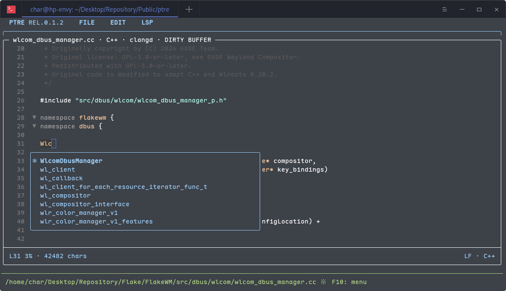

# Pointer Editor
*Pointer Editor* (we'll call it Pointer or `ptre` in the rest of the document) is a currently under developing (we just started it) lightweight text editor in Rust.



## Build & Run
Please have Rust & Cargo ready, then you may use the following command to build:
```bash
$ cargo build
```

You may find the binary file on `target/debug/build/ptre`.

To run the code directly:
```bash
$ cargo run
```

To open an existing file in the editor buffer, pass its relative or absolute path:
```bash
$ cargo run -- README.md
```
Directories and multiple arguments are rejected.

## Packaging
### Debian
> **NOTE**: Network connection WILL BE REQUIRED!!

To build a Debian binary package, simply run:

```bash
$ ./build-deb -d
```

Dependencies will automatically being installed to your computer.

Next time you may run:

```bash
$ ./build-deb
```

To do a cleanup, run:
```bash
$ ./build-deb -c
```

## Shortcuts
> **Note**: If we provide shortcuts like `Ctrl + X` `Ctrl + S`, it means that you'll need to press `Ctrl + X` first and 
> hit `Ctrl + S` immediately after then.

* **Save**: `Ctrl + X` `Ctrl + S`.
* **Quit**: `Ctrl + X` `Ctrl + C`.
* **Cut**: `Ctrl + W`.
* **Copy**: `Alt + W`.
* **Paste**: `Ctrl + Y`.
* **Complete** (open/close the completion popup): `Alt + /`.
* **Toggle auto completion**: `Ctrl + C` `Alt + L`.

## Plugins
### Code Completion Service
Code (auto) completion services are provided through LSP. `ptre` communicates w/ it via JSON-RPC protocol.

Each LSP configuration needs one config file: A `.conf` file named with the language name (actually the language name var that is used by `ratatui-code-editor`) with command instructions inside.

`ptre` will read those configuration files from `~/.config/ptre/plugins/lsp/` or `$XDG_CONFIG_HOME/ptre/plugins/lsp/`.

#### File name
The file name is just the language name, while the extension name is `.conf`. Availiable names are `text`, `rust`, `javascript`, `typescript`, `python`, `go`, `java`,  `c_sharp`, `c`, `cpp`, `html`, `css`, `yaml`, `json`, `toml`, `shell`, and `markdown`.

#### Internal fields
* **command**: The ELF name of LSP and its argument(s) seperated by space. if there is a space inside the argument, please use string quotes.
* **enabled**: (Optional) Decides whether to enable the completion service. Accepts `true` or `false`, and the fall back (default) value is `true`.

#### Built-in Language Support
`ptre` uses `clangd` as LSP for C/C++, and `rust-analyzer` for Rust. You may write your own `c.conf`, `cpp.conf`, and`rust.conf` to override the settings.

#### Behavior
If the lsp ELF is NOT found, `ptre` will skip using the current LSP and only uses the context from current file to do the completion.

## C++ Checks
In C++ mode, the LSP menu offers separate Clang-tidy and Cpplint switches. Both are off by default. Enabling Cpplint for the first time asks for its executable path (spaces and `~/` are supported).

* **Cpplint**: `Ctrl + C`, then plain `l`.
* **Clang-tidy**: `Ctrl + C`, then plain `t`; `clang-tidy` must be on `PATH`.

Save the buffer before checking. Checks run in the background without changing the file. Results include stdout, stderr and exit status; use Up/Down or PageUp/PageDown to scroll and Esc to close. Clang-tidy uses its normal project configuration; ptre does not add compiler flags or apply fixes.

Switches and the Cpplint path are saved in `$XDG_CONFIG_HOME/ptre/cpp-checks.json` (fallback: `~/.config/ptre/cpp-checks.json`). Edit `cpplint_path` there to change the executable for the next session.

## Dependencies
Special thanks to these libraries:
* **Crossterm-rs**: https://github.com/crossterm-rs/crossterm
* **Lsp-types**: https://github.com/gluon-lang/lsp-types
* **Ratatui**: https://github.com/ratatui/ratatui
* **Ratatui-code-editor**: https://github.com/vipmax/ratatui-code-editor
* **Serde-json**: https://github.com/serde-rs/json

For all dependencies, please refer to [Cargo.lock](./Cargo.lock).

## License
Pointer is licensed under *GNU GENERAL PUBLIC LICENSE  Version 3*, you may find a copy of the license [here](./LICENSE).
